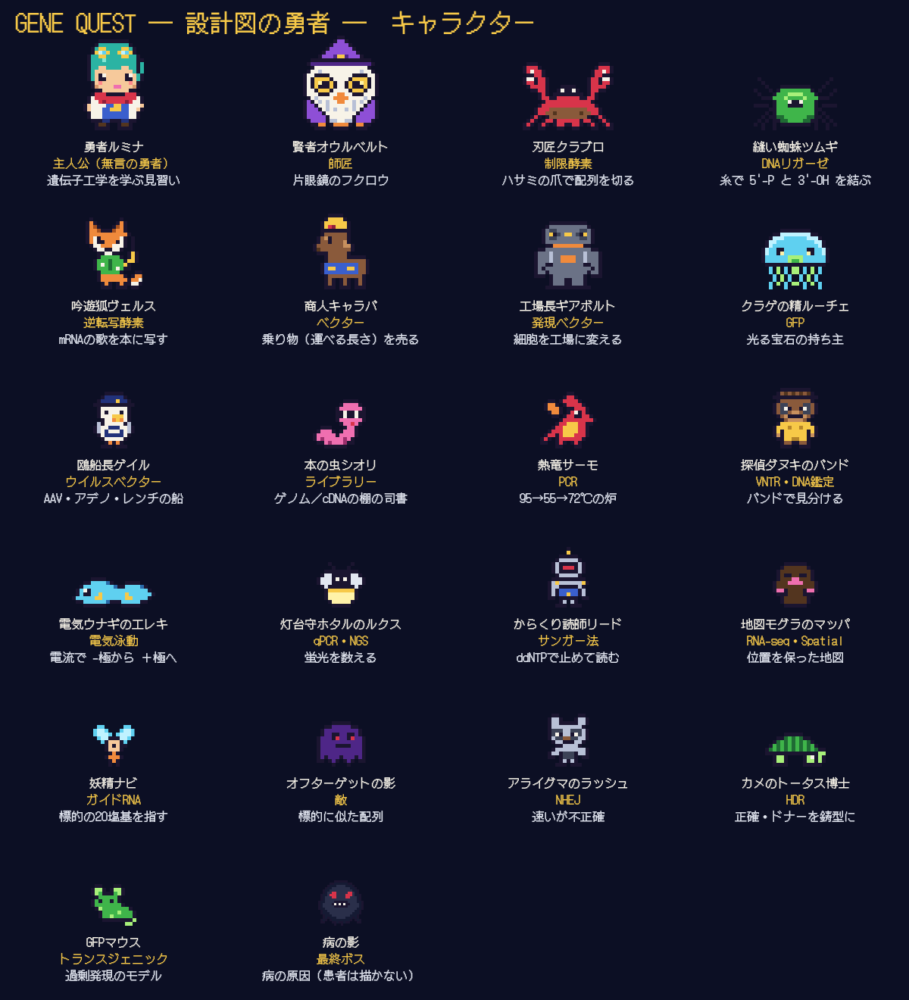

# GENE QUEST ― 設計図の勇者 ―（遺伝子工学・ドラクエ風教育アニメ）制作パッケージ

講義資料「遺伝子工学」（遺伝医学 2026.10.05）を一次資料にした、16ビット風ピクセルアートRPGの教育アニメです。
勇者ルミナが賢者オウルベルトに導かれ、制限酵素からゲノム編集まで22の町と戦闘をめぐって「道具」を集め、最後にすべてを組み合わせて「病の影」に挑みます。
絵・音楽・効果音はすべてコードから生成しています（素材の流用なし）。

| | |
|---|---|
| 完成版 | `final.mp4`（1920×1080・24 fps・H.264／AAC 320 kbps 48 kHz・日本語字幕トラック付き・8分11秒） |
| 字幕 | `subtitles.srt`（全51行・UTF-8） |
| 最終タイムライン | `TIMELINE.md`（場面・全台詞・BGM・効果音の時刻。`docs.py` が実測値から書き出す） |
| 台本（読み上げ用） | `script.json`（字幕の文 `text` と、読み上げ用の読み `speech`） |
| 実測タイミング | `timing.json`（各行の開始・長さ）／`cues.json`（効果音234個の時刻） |
| キャラクター表 | `assets/cast.png` |
| ステム（再生成） | `audio/stems/`：`voice.wav`（`voice_narrator.wav`／`voice_sage.wav`）・`lead.wav`・`pad.wav`・`rhythm.wav`・`bgm.wav`・`se.wav`、マスター `audio/master.wav`（48 kHz WAV。大きいので Git には入れず `build.sh` で再生成） |

## これまでの作品と似ないようにしたこと

このリポジトリの既存作品（「設計図の図書館」「写字室の朝」「午前二時の本社ビル」「十二分間の旅」「コウと揺れる街」「生命史線の夜行列車」と、黒板の授業動画6本）を読んだうえで、次のように方向を変えています。

| | これまでの作品 | GENE QUEST |
|---|---|---|
| 語り | 一人称の「僕」が語る、乾いた文学的な文体 | 三人称のナレーター＋賢者の短い一言。主人公は話さない「無言の勇者」 |
| 主人公 | 茶色のテーマ色の少年（ジン・タグ・コウ・ハル・ペプ） | 青緑のポニーテールとゴーグルの少女ルミナ（白い実験コートのマント） |
| 登場人物 | 人間の司書・職人・守衛など。名前は分子名を縮めた2音（デオ・ポル・ヒスト…） | 動物と幻想の生き物：フクロウ・カニ・クモ・キツネ・ラクダ・ゴーレム・クラゲ・カモメ・本の虫・竜・タヌキ・ウナギ・ホタル・からくり人形・モグラ・妖精・アライグマ・カメ |
| 絵 | 映画的な2Dリグ、モーションキャプチャのシルエット、チョークの黒板 | 480×270 のドット絵（1画素＝4×4画素に拡大）、RPGのウィンドウ、ドットフォント |
| 構成 | 一晩の旅・一日の仕事 | 章ごとの町、2回の戦闘（PCR・CRISPR）と最終決戦。道具の入手とレベルアップ（Lv 1 → 30） |
| 音 | 既存のフリー音源（incompetech・魔王魂）とジャズ | このために作曲した21曲のチップチューン（矩形波・三角波・ノイズ）と合成効果音 |

## キャラクター



| キャラクター | 表すもの |
|---|---|
| 勇者ルミナ | 主人公（無言）。章ごとに道具を手に入れ、レベルが上がる |
| 賢者オウルベルト | 師匠（声：ja-JP-KeitaNeural を低く）。片眼鏡のフクロウ |
| 刃匠クラブロ（カニ） | 制限酵素。BamHI・SmaI で切り、突出末端と平滑末端を見せる |
| 縫い蜘蛛ツムギ（クモ） | DNAリガーゼ。糸で 5'-P と 3'-OH を結ぶ |
| 吟遊狐ヴェルス（キツネ） | 逆転写酵素。mRNA の「歌」を cDNA の「本」に写す |
| 商人キャラバ（ラクダ） | ベクター。プラスミド〜YAC を「運べる長さ」で売る |
| 工場長ギアボルト（ゴーレム） | 発現ベクター |
| クラゲの精ルーチェ | GFP |
| 鴎船長ゲイル（カモメ） | ウイルスベクター（AAV・アデノ・レンチの3隻） |
| 本の虫シオリ | ライブラリーとスクリーニング |
| 熱竜サーモ | PCR（戦闘で仲間になる） |
| 探偵ダヌキのバンド | PCRクローニング・VNTR による DNA 鑑定 |
| 電気ウナギのエレキ | 電気泳動 |
| 灯台守ホタルのルクス | RT-PCR・qPCR・NGS の蛍光 |
| からくり読師リード | サンガー法 |
| 地図モグラのマッパ | RNA-seq・シングルセル・Spatial |
| 妖精ナビ | ガイドRNA |
| オフターゲットの影 | 敵。標的に似た配列 |
| アライグマのラッシュ／カメのトータス博士 | NHEJ（速いが不正確）／HDR（正確、ドナーを鋳型に） |
| 病の影 | 最終ボス。病の原因そのもの（患者は描かない） |

## 場面とBGM

| # | 区間 | 場面 | BGM（オリジナル） | ムード |
|---|---|---|---|---|
| 1 | 0:00–0:20 | タイトル → 賢者の書斎（どうぐぶくろ入手） | 序章の荘厳 | 壮麗・導入（80 BPM） |
| 2 | 0:20–0:40 | 伝説の石碑：1869 DNA → 1953 二重らせん → 1962 制限酵素 → 1977 配列決定 → 1985 PCR → 2004 ヒトゲノム（約50年） | 発見の巻物 | 軽快・知的好奇心 |
| 3 | 0:40–1:05 | 第1章 刃の港町：BamHI（G▼GATCC、回文）→ 5'突出末端、SmaI（CCC▼GGG）→ 平滑末端、4酵素の切り口表 | 鍛冶屋のリズム | 金属感・躍動 |
| 4 | 1:05–1:25 | 第2章 糸紡ぎの村：接着末端の対合 → ニックの 3'-OH／5'-P → 封じる（ATP） | 接合の温もり | 温かい・安定 |
| 5 | 1:25–1:40 | 同：BamHI × BglII → GGATCT／AGATCC | 接合の温もり（つづき） | 〃 |
| 6 | 1:40–2:05 | 第3章 歌う森：ポリT プライマー → cDNA → RNアーゼH → 二本鎖 cDNA | 録音の魔法 | 神秘・穏やか |
| 7 | 2:05–2:30 | 第4章 キャラバンの市場：ベクターと挿入長、pUC18（2,686 bp・Ampʳ・ori・lacZ/MCS） | 市場の賑わい | 活気・選択肢 |
| 8 | 2:30–2:55 | 第5章 歯車の工場：プロモーター＋目的遺伝子 → 細胞 → mRNA → タンパク質 | 工場の稼働 | 力強い・機械的 |
| 9 | 2:55–3:15 | 第6章 光の入り江：GFP 融合タンパク質、生きた細胞で光る、下村 脩 博士 | 光る宝石 | 柔らかく神秘的 |
| 10 | 3:15–3:40 | 第7章 宅配の港：AAV／アデノ／レンチのステータス、宿主染色体への組み込み、AAV血清型 | 港の配達 | 海・信頼感 |
| 11 | 3:40–4:05 | 第8章 遺伝子の図書館：ゲノム／cDNA ライブラリー、コロニーハイブリダイゼーション | 図書館の静寂 | 静謐・探索 |
| 12 | 4:05–4:30 | 第9章 熱竜の炉（戦闘）：95→55→72 ℃、2の n 乗、プライマー対 | コピーの術（戦闘） | テンポ良く躍動 |
| 13 | 4:30–4:55 | 第10章 探偵の事務所：PCR クローニング、VNTR 3座位のゲル（試料F＝Bさん） | 探偵の足跡 | 忍び足・スウィング |
| 14 | 4:55–5:15 | 第11章 雷の川：−→＋、小さい断片ほど速い、EtBr と UV（260→590 nm） | 泳動の川 | 流れ・前進 |
| 15 | 5:15–5:40 | 第12章 灯台の観測所：RT-PCR（細胞A・B）、増幅曲線と Ct、検量線 | 解析の灯 | 知的・落ち着き |
| 16 | 5:40–6:00 | 第13章 からくり塔：ddNTP の停止、キャピラリー、波形と読み | 配列の機械 | 機械的・整然 |
| 17 | 6:00–6:25 | 第14章 蛍の大平原：フローセル、ブリッジPCR、クラスター、リードのマッピング | 並列の奔流 | 高密度・エネルギー |
| 18 | 6:25–6:46 | 第15章 地図職人の谷：RNA-seq（総和）／シングルセル／Spatial | 空間の地図 | 広がり・神秘 |
| 19 | 6:46–7:08 | 第16章 編集の祭壇（戦闘）：ガイドRNA・PAM・二本鎖切断、オフターゲット、ZFN・TALEN | 編集の一閃（戦闘） | 緊張・決意 |
| 20 | 7:08–7:28 | 修復の分かれ道：NHEJ（欠失・挿入、フレームシフト）／HDR（ドナー、細胞周期依存） | 修復の対比 | 対比的・短調 |
| 21 | 7:28–7:49 | 最終章：トランスジェニック／ノックアウトマウス → 15の道具の連続技 → 勝利・Lv 30 | 最終決戦 | 高揚・クライマックス |
| 22 | 7:49–8:11 | エピローグ：安全性・倫理・社会的責任の三つの星 → おわり | 静かな結び | 静謐・余韻 |

**BGMの作り**：各曲は `audio.py` の `TRACKS` にある和声進行・旋律モチーフ・ベース型・ドラム型から合成します。ステムは「旋律（lead：矩形波）」「和声＋ベース（pad：細い矩形波のアルペジオ＋三角波）」「リズム（rhythm：ノイズ・キック）」の3本。台詞の間は自動で −10 dB（アタック 80 ms・リリース 400 ms）下がります。場面の境目は 0.6 秒のクロスフェード。

## 効果音

すべて `audio.py` の `SE` で合成。主なもの：風（0:00）、おふれを貼る（0:03）、ページめくり（年表）、ハサミで切る／まっすぐ切る（制限酵素）、接合の「ピタッ」（リガーゼ）、ジグソーパズル合体（1:30）、録音ピッ・テープ巻き（逆転写）、市場の賑わい、工場稼働・ファンファーレ、光のチャイム（GFP）、港の汽笛・配達ベル、本を引く、熱サイクル「シュー／ピタ／タタタ」（PCR）、プリント音、スキャナー（4:48）、ゲル走行音、Ct 到達アラート、読み取りピッ・解析完了ジングル、連続ビート・クラスター生成ポップ、ヒートマップ表示、斬撃・衝撃波（ゲノム編集）、ガムテープ／チクタク（NHEJ/HDR）、勝利のファンファーレ、小さなベル。ほかにRPGの定番（カーソル・決定・アイテム入手・レベルアップ・エンカウント・じゅもん）。時刻の一覧は `TIMELINE.md`。

## ミックスと書き出し

- ラウドネス：マスターを **−16 LUFS**（2パスの loudnorm、真のピーク −1.5 dBTP）。ミックス前の比は、ナレーション −14 LUFS に対し BGM −21.5・効果音 −21.8（ゲート付き積分値）。
- 映像：内部 960×540 → 最近傍で 1920×1080。H.264（CRF 17・`-tune animation`）、24 fps。
- 音声：48 kHz。ステムは WAV（16 bit）、完成版は AAC 320 kbps。
- 字幕：`subtitles.srt` を完成版に mov_text として同梱（画面のメッセージウィンドウにも同じ文が1文字ずつ出る）。

## 作り直す

```bash
pip install edge-tts mutagen numpy          # 声（Microsoft のニューラル音声。APIキー不要）
npm install                                 # @napi-rs/canvas（Skia）で1コマずつ描く
bash production/gene-quest/build.sh         # 声 → 効果音の時刻 → 絵 → 音楽とミックス → 字幕 → final.mp4
SKIP_VIDEO=1 bash production/gene-quest/build.sh   # 音だけ直したとき
node production/gene-quest/src/render.mjs --stills 52,140,258 /tmp/st   # 静止画で確認
```

- 声は1行ずつ `.audio-cache/gene-quest/` にキャッシュされ、変えた行だけ録り直します。
- 行は `script.json` の時刻に置きます。前の行がまだ話していれば、その分だけ後の場面ごと後ろへずらします（無理に早口にしない。早めるのは最大 +10% まで）。
- 絵は `src/scenes1.mjs`（1〜9場面）・`src/scenes2.mjs`（10〜22場面）。各場面は台詞の開始時刻（`S(b, 行, 秒)`）を基準に動くので、声を録り直しても絵と音がずれません。
- 人物・小道具のドット絵は `src/sprites.mjs`（1文字＝1画素）、背景と分子の図は `src/kit.mjs`、ウィンドウと文字は `src/engine.mjs`。

## 依頼された台本・計画からの変更点

内容は講義資料に合わせ、次の点だけ変えています。

1. **2:38 の例**：「インスリンや抗体など」→「インスリンや成長ホルモン、ワクチンの抗原など」（資料の「組換え体技術の応用」の列挙に合わせた）。
2. **PCR の温度**：95 ℃（変性）→ 55 ℃（アニーリング）→ 72 ℃（伸長）。資料のアニメーション（温度計）の値。
3. **サンガー法の例**：資料の図はプライマーが「5'GTAC3'」と書かれていますが、鋳型 3'-GTACGACCATTAG-5' に結合し、合成産物（5'CATGC…）の先頭になるのは 5'-CATG-3' です。映像は 5'-CATG-3' にしています。
4. **長さ**：計画の 7:50 に対し 8:11。声を自然な速さで読むと 6:00 以降の台詞が長く、後半の場面を最大 8.8 秒ずつ後ろへずらしました（`TIMELINE.md` の「計画 → 実際」）。最後の「おわり」の画面を約4秒とっています。
5. **BGM**：計画で曲のなかった 1:25–1:40 は「接合の温もり（つづき）」、4:30–4:55 は「探偵の足跡」、4:55–5:15 は「泳動の川」を加えて全21曲。
6. **補足（資料の外の一般的な知識）**：Cas9 が PAM（NGG）の3塩基上流で切ること、DNA が負の電荷をもつこと、EtBr を扱うときの手袋・廃液処理。画面ではそれぞれ一言だけ。

## 表現上の配慮

- 治療の話題は扱いを最小限に。患者・実在の症例は描かず、最終ボスは「病の原因」を抽象化した影にしています。
- 実名は資料にある研究者名（年表・GFP の下村 脩 博士）のみ。
- 1場面1概念。比喩（ハサミ・糸・乗り物・工場・宝石・宅配便・図書館・炉・地図）を道具として繰り返し、最後に全部を組み合わせて使う構成で記憶をつなげます。
- エピローグで安全性・倫理・社会的責任を明示します。

## ライセンス

| 素材 | 出典 | ライセンス |
|---|---|---|
| ドット絵・キャラクター・背景 | このリポジトリのコード（`src/`） | オリジナル |
| BGM 21曲・効果音 | `audio.py` で合成 | オリジナル |
| 声 | 音声合成（ja-JP-NanamiNeural／KeitaNeural。実在の人物の声ではない） | — |
| フォント DotGothic16 | Fontworks（`fonts/OFL-DotGothic16.txt`） | SIL Open Font License 1.1 |
| 医学的内容 | 講義資料「遺伝子工学」（遺伝医学 2026.10.05） | — |

「ドラクエ風」は、RPGのウィンドウ・コマンド・レベルアップといった一般的な形式のことです。特定のゲームの曲・キャラクター・ロゴ・効果音は使っていません。
